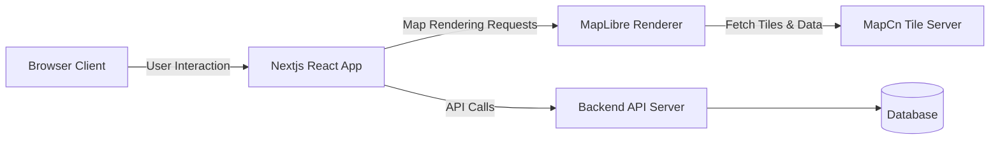
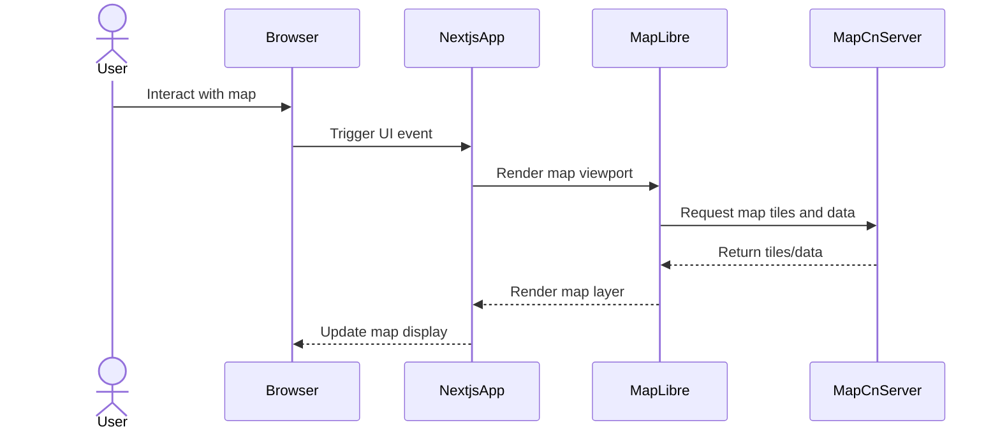

# gmap-mapcn
_A next generation map application with MapCn and MapLibre built on Nextjs_

gmap-mapcn is a modern, performant map application leveraging Nextjs and MapCn’s mapping data with MapLibre’s rendering capabilities. It provides an interactive map experience with rich UI controls and extensibility for developers and end users alike.

---

## Table of Contents
- [Introduction](#introduction)
- [Features](#features)
- [Architecture](#architecture)
- [Workflow](#workflow)
- [Tech Stack](#tech-stack)
- [Installation](#installation)
- [Project Structure](#project-structure)
- [Usage](#usage)

---

## Introduction
Mapping solutions often struggle with balancing rich interactive features, performance, and developer ease of use. gmap-mapcn addresses this by integrating Nextjs’s SSR and React component model with MapCn’s detailed map data and MapLibre’s open-source rendering.

This project benefits:
- Web developers seeking a customizable map UI framework
- End users looking for smooth map interactions and diverse controls
- Teams wanting to build mapping apps with modern frontend technologies

| Feature               | gmap-mapcn                      | Alternative A                 | Alternative B                 |
|-----------------------|--------------------------------|------------------------------|------------------------------|
| Framework             | Nextjs + React                  | Vanilla JS                   | Angular                      |
| Map Data Source       | MapCn                          | Google Maps                  | OpenStreetMap                |
| Renderer              | MapLibre GL                    | Google Maps JS API           | Leaflet                     |
| Custom UI Controls    | Modular React components        | Limited / Proprietary        | Plugin dependent             |
| Deployment           | Static + SSR optimized          | Client-side heavy            | Client-side only             |
| Open Source           | Yes                            | No                          | Yes                         |

---

## Features

### Core Features
- 🗺️ **Interactive Map Rendering** with MapLibre and MapCn data for seamless navigation
- 📍 **Rich Marker & Popup Support** including labels, tooltips, and custom content
- 🔄 **Dynamic Controls** like zoom, rotate, locate, layers toggle, and route plotting

### Developer Experience
- ⚛️ **React Component Based UI** built for easy customization and extension
- 🛠️ **TypeScript & TailwindCSS** for type safety and modern styling
- 📚 **Well Structured Codebase** with modular components and utilities

### Deployment
- 🚀 **Nextjs SSR & Static Generation** for optimized performance and SEO
- ☁️ **Easy Environment Setup** with environment variables and config files
- 🔄 **Hot Reloading & Fast Refresh** during development

---

## Architecture



| Component       | Role                              | Technology           |
|-----------------|----------------------------------|----------------------|
| Browser Client  | User interface and interaction   | React, Nextjs        |
| Nextjs React App| Frontend app with UI components   | React, TypeScript    |
| MapLibre Renderer| Maps rendering engine             | MapLibre GL          |
| MapCn Tile Server| Map data source                   | MapCn Tiles          |
| Backend API Server| Backend services and data         | Node.js / Nextjs API |
| Database        | Persistent data storage           | (Optional)           |

---

## Workflow



Step-by-step:
1. User interacts with the map UI in the browser (zoom, pan, select marker).
2. Browser triggers UI event handled by Nextjs React app.
3. Nextjs app commands MapLibre to update the rendered map viewport.
4. MapLibre requests required map tiles and vector data from MapCn tile server.
5. MapCn server returns requested tiles/data to MapLibre.
6. MapLibre renders the new map layers and features.
7. Nextjs app updates the UI and re-renders the map display to the user.

---

## Tech Stack

| Layer         | Technology          | Purpose                      |
|---------------|---------------------|------------------------------|
| Frontend      | Nextjs, React       | UI rendering and interactivity|
| Styling       | TailwindCSS         | Utility-first CSS styling     |
| Mapping       | MapLibre GL, MapCn  | Map rendering and data source |
| Backend       | Nextjs API routes   | API and server-side logic     |
| Fonts & Icons | Google Fonts, Lucide| Typography and iconography    |

---

## Installation

### Prerequisites
- Node.js v18+
- npm or yarn package manager
- MapCn tile server access (if self-hosted)

### Quick Start

```bash
git clone https://github.com/Pranesh-2005/gmap-mapcn.git
cd gmap-mapcn
npm install
npm run dev
```

### Environment Setup

```bash
cp .env.example .env
# Edit .env to configure API keys, tile server URLs, and feature flags
```

---

## Project Structure

```
gmap-mapcn/
├── app/                   # Nextjs app directory with pages and layouts
│   ├── globals.css        # TailwindCSS and global styles
│   ├── layout.tsx         # Root layout component with font and metadata
│   └── page.tsx           # Main page with map and UI components
├── components/            # React UI components
│   └── ui/                # Modular UI controls and map components
├── lib/                   # Utility functions and helpers
├── public/                # Static assets like icons and fonts
├── styles/                # Additional stylesheets if any
├── next.config.ts         # Nextjs configuration
├── package.json           # npm dependencies and scripts
└── README.md              # Project documentation
```

---

## Usage

### Basic Example

```tsx
import { Map } from "@/components/ui/map";

export default function BasicMap() {
  return (
    <Map initialViewport={{ longitude: 120, latitude: 30, zoom: 8 }}>
      {/* Add markers or controls here */}
    </Map>
  );
}
```

### Advanced Example with Markers and Controls

```tsx
import {
  Map,
  MapMarker,
  MapControls,
  MarkerPopup,
} from "@/components/ui/map";

export default function AdvancedMap() {
  return (
    <Map initialViewport={{ longitude: 120, latitude: 30, zoom: 10 }}>
      <MapControls showZoom showRotate showLocate />
      <MapMarker longitude={120.15} latitude={30.25}>
        <MarkerPopup>
          <div>Custom Location Info</div>
        </MarkerPopup>
      </MapMarker>
    </Map>
  );
}
```

---

Build rich, interactive maps with gmap-mapcn — a cutting-edge framework that combines Nextjs, MapCn, and MapLibre for performant and extensible mapping experiences. Happy mapping! 🚀

## License
This project is licensed under the **MIT** License.

---
🔗 GitHub Repo: https://github.com/Pranesh-2005/gmap-mapcn